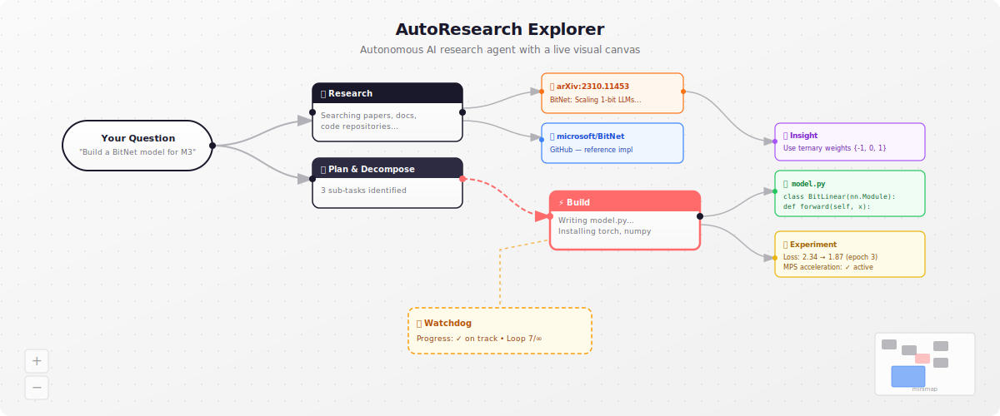
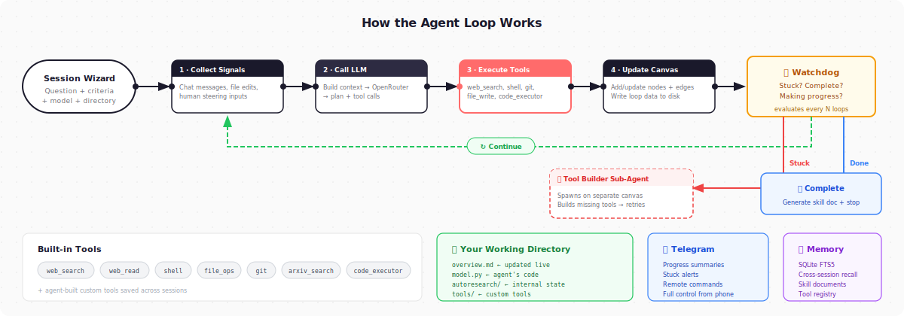

# AutoResearch Explorer

> **Early-stage project** — this is an active work in progress. Expect rough edges, incomplete features, and things that break. Contributions and bug reports are welcome.

An autonomous AI research agent with a live visual canvas. Give it a question — it researches, builds, and iterates while you watch, steer, or walk away.

<p align="center">
  
</p>

The agent's thinking is externalized as an interactive node graph. Every source it finds, every decision it makes, every piece of code it writes — visible on the canvas in real time. You intervene when you want to. The rest of the time, it works autonomously.

---

## What it does

You describe what you want — "Build me a BitNet model for my MacBook M3 Pro" or "Survey mechanistic interpretability papers from 2024-2026" — and the agent:

1. **Researches** — searches the web, reads papers, gathers information
2. **Plans** — decomposes the problem into sub-questions on the canvas
3. **Builds** — writes code, runs experiments, creates files in your chosen directory
4. **Iterates** — evaluates results, adjusts approach, keeps going until done
5. **Self-heals** — when stuck, builds itself new tools, tries different approaches, or asks you via Telegram

You watch the canvas grow, zoom into any node for details, chat with the agent to steer it, or check in later via Telegram.

---

## Features

**Visual research canvas** — React Flow-powered infinite canvas with dynamic node types. The agent invents its own node types based on what it discovers — architecture blocks, source nodes, experiment results — not limited to a fixed schema.

**Multi-canvas architecture** — when the agent needs a tool that doesn't exist, it spawns a sub-agent on a separate canvas to build it. You see the full tree of canvases in the sidebar.

**Self-improving** — builds custom tools when stuck, saves them globally for future sessions. Generates skill documents summarizing what worked and what failed. Cross-session memory via SQLite FTS5.

**Works in your directory** — all code, research data, and artifacts are written to a folder you choose. No hidden state — everything is inspectable.

**Watchdog metacognition** — a separate evaluator checks every few loops: is the agent making progress? Is it stuck? Is the research complete? Automatically triggers corrective actions or stops when done.

**Telegram integration** — progress summaries, stuck alerts, and full remote control. Give it a task and go live your life.

**Any LLM via OpenRouter** — searchable model picker with pricing. Use Claude, GPT-4, Gemini, Llama, Qwen, or any model on OpenRouter.

---

## Quick start

### Prerequisites

- [Node.js](https://nodejs.org/) 18+
- [Rust](https://rustup.rs/) (latest stable)
- [Tauri prerequisites](https://tauri.app/start/prerequisites/) for your OS
- An [OpenRouter](https://openrouter.ai/) API key

### Install and run

```bash
git clone https://github.com/YOUR_USERNAME/autoresearch-explorer.git
cd autoresearch-explorer
npm install
npm run tauri dev
```

The app opens as a native desktop window. Create a new research session through the wizard.

### Build for production

```bash
npm run tauri build
```

Produces a native binary in `src-tauri/target/release/`.

---

## How it works

<p align="center">
  
</p>

---

## Built-in tools

| Tool | What it does |
|---|---|
| `web_search` | Search the web |
| `web_read` | Fetch and parse a URL to markdown |
| `shell` | Run any shell command natively (full GPU/MPS access) |
| `file_read` / `file_write` / `file_list` | File operations in the working directory |
| `git` | Clone, commit, diff, log, branch |
| `package_manager` | Auto-detect pip/npm/cargo and install packages |
| `arxiv_search` | Search arXiv for papers, returns structured metadata |
| `code_executor` | Run Python/JS/Bash/Swift code |

The agent can also build its own tools at runtime and save them for future sessions.

---

## Session wizard

The 6-step wizard guides you through:

1. **What are you researching?** — describe your goal
2. **What does success look like?** — define completion criteria (the watchdog uses this to know when to stop)
3. **How should the agent work?** — pick an approach (build a project, literature review, explore a topic, ML optimization, build a tool, build a skill)
4. **Where should it work?** — pick a folder on your machine
5. **Model & API** — choose any model on OpenRouter
6. **Past experience** — load relevant skills and tools from previous sessions

---

## Tech stack

| Component | Choice |
|---|---|
| Desktop shell | Tauri (Rust) |
| Frontend | React 19 + TypeScript |
| Canvas | React Flow |
| State | Zustand |
| LLM | OpenRouter (any model) |
| Memory | SQLite FTS5 (rusqlite) |
| Messaging | Telegram Bot API |
| Persistence | JSON files on disk |

---

## Project structure

```
src/                    # React frontend
  ├── canvas/           # React Flow canvas components
  ├── panels/           # Sidebar panels (detail, chat, settings)
  ├── panels/wizard/    # Session creation wizard
  ├── stores/           # Zustand state stores
  └── hooks/            # Tauri event listeners

src-tauri/              # Rust backend
  ├── src/agent/        # Agent runtime, watchdog, checkpointing
  ├── src/commands/     # Tauri IPC commands
  ├── src/llm/          # LLM client (OpenRouter)
  ├── src/storage/      # Session persistence, global index
  ├── src/telegram/     # Telegram bot
  └── src/tools/        # Built-in tool implementations

templates/              # Prompt templates (.md files)
docs/plans/             # Design documents
```

---

## Inspiration

- [Karpathy's autoresearch](https://github.com/karpathy/autoresearch) — proved autonomous experiment loops work
- [Hermes Agent](https://github.com/NousResearch/hermes-agent) — self-improving agent with persistent memory and skill documents
- [Reflexion](https://arxiv.org/abs/2303.11366) — agent state as self-modifying prompt
- Self-driving labs (DMTA loop) — autonomous research systems in chemistry and materials science

---

## Contributing

Contributions welcome. The easiest way to contribute is to write a prompt template for a domain you know well — templates are single Markdown files, no code required.

For code contributions:

```bash
# Fork and clone
git clone https://github.com/YOUR_USERNAME/autoresearch-explorer.git
cd autoresearch-explorer

# Install dependencies
npm install

# Run in development
npm run tauri dev

# Type check
npx tsc --noEmit
cd src-tauri && cargo check
```

---

## License

[GNU Affero General Public License v3.0](LICENSE)

Copyright (c) 2026 Mekyle Naidoo
